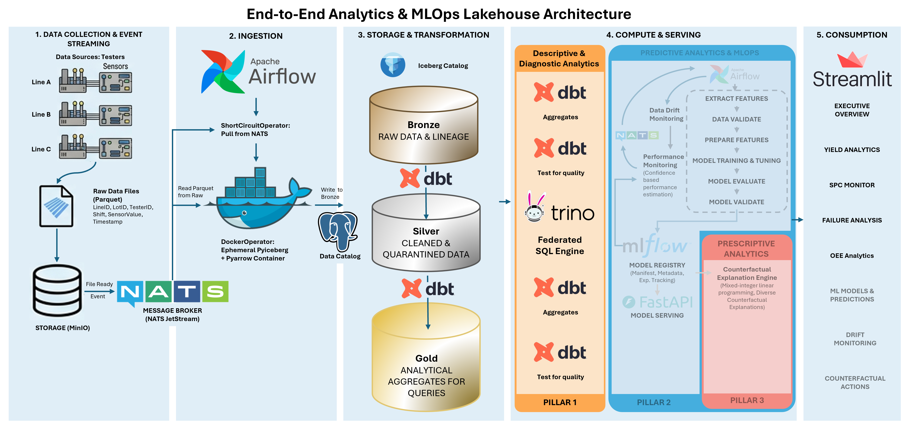
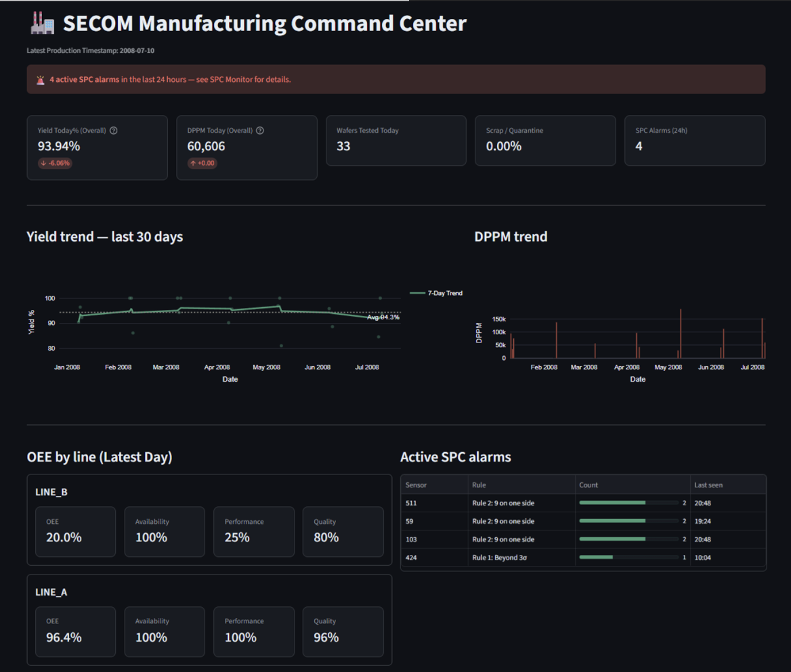
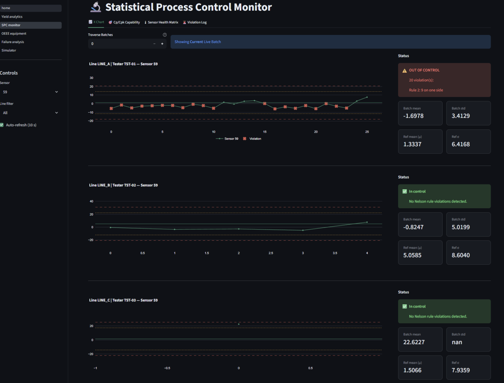
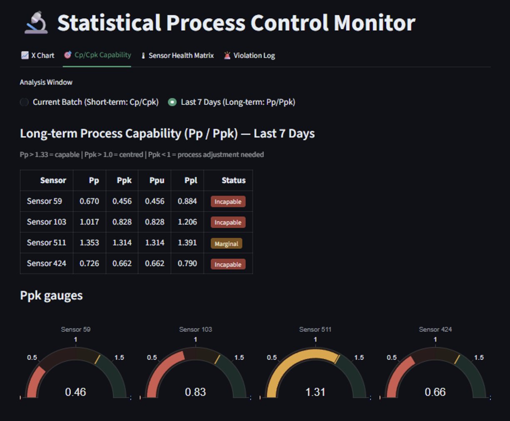
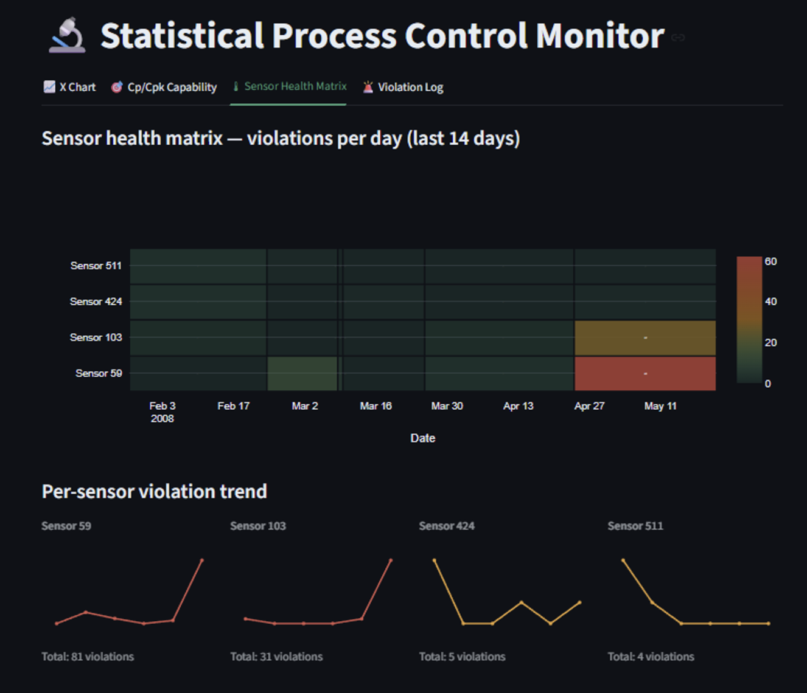
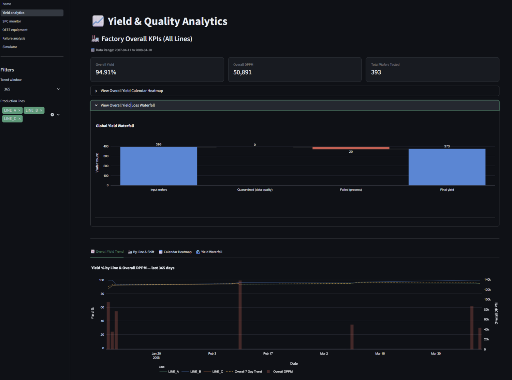
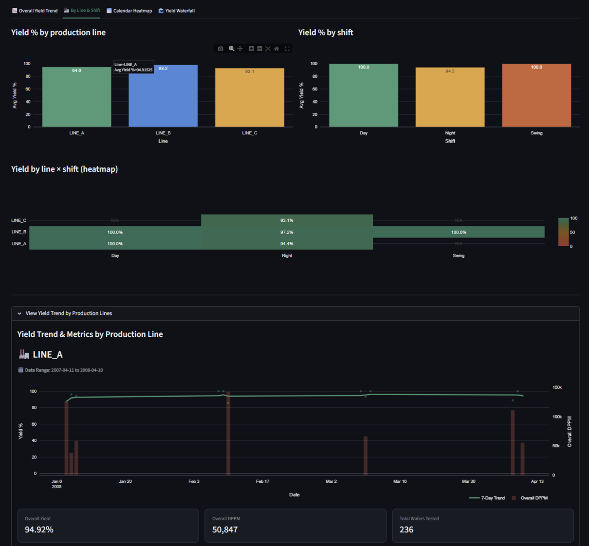
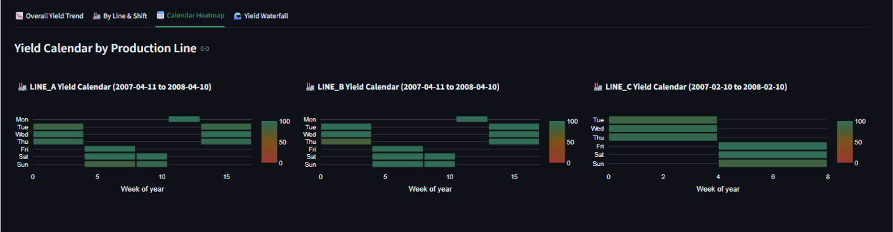
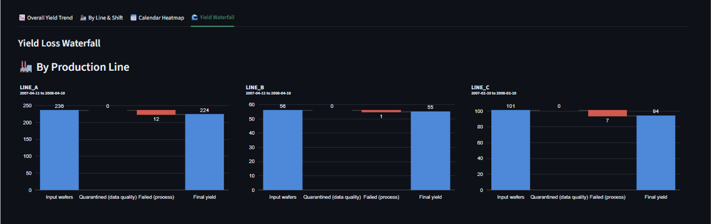
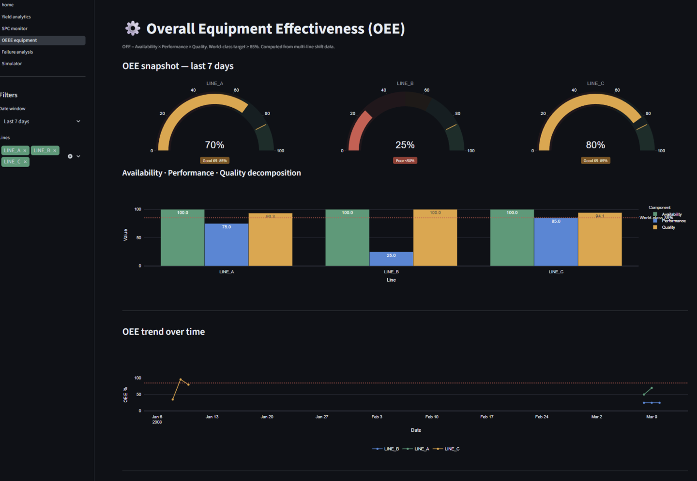

<!-- omit from toc -->
# SECOM Factory Pulse: End-to-End Semiconductor Yield & Process Monitoring

<!-- omit from toc -->
### A Medallion Lakehouse platform for predictive yield analytics and Statistical Process Control (SPC) using dbt, Trino, and Apache Iceberg.

**Project Description:** This project implements an end-to-end data engineering and ML pipeline designed to process high-dimensional sensor data (UCI SECOM dataset). The system is modeled to address the "late-detection" challenge in semiconductor manufacturing by providing visibility into process capability ($Cp$, $Cpk$), yield analytics and statistical drift detection.

The solution utilizes a **Medallion Lakehouse** pattern to decouple high-frequency data ingestion from analytical serving. By leveraging event-driven and batch processing, the architecture transforms raw sensor measurements into structured datasets suitable for root-cause analysis. Ultimately, this project seeks to identify potential yield loss drivers before wafers reach end-of-line (EOL) inspection. By predicting outcomes early in the process, the system enables more efficient allocation of testing resources, prioritizing units with a high probability of passing and reducing unnecessary throughput bottlenecks.

## Table of Contents
- [Table of Contents](#table-of-contents)
  - [Executive Summary](#executive-summary)
  - [System Overview \& Architecture](#system-overview--architecture)
  - [Data Modeling \& Storage Strategy](#data-modeling--storage-strategy)
  - [Key Engineering Challenges](#key-engineering-challenges)
  - [ML \& Actionable AI (Development Branch)](#ml--actionable-ai-development-branch)
  - [How to Run](#how-to-run)
  - [Roadmap \& Future Work](#roadmap--future-work)
  - [Author](#author)
  - [License](#license)
  - [Appendices: Dashboard Overview](#appendices-dashboard-overview)
  - [Attribution](#attribution)

---

### Executive Summary
In semiconductor fabrication, monitoring thousands of sensor signals to predict yield failure can be traditionally manual and reactive process. This platform aims to address the gap between raw telemetry and process control by providing an automated environment for detecting excursions and identifying failure drivers. By shifting from reactive troubleshooting to proactive monitoring, the system provides a unified view of process health, allowing engineering teams to identify equipment drift before it impacts final wafer yield.

* **The Goal:** To operationalize high-dimensional sensor streams by correlating raw measurements with statistical monitoring and ML inference. This transforms unstructured process telemetry into a "single source of truth" for evaluating process capability, yield, equipment health, and root causes of yield loss.

* **The Solution:** A scalable Medallion Lakehouse with automated pipelines that ingests raw data generated by testers into Iceberg table format, enabling batch processing with dbt and trino, and orchestrated by Airflow. An unified dashboard queried from "Gold" layer for descriptive and diagnostic analytics while automated machine learning pipelines to offer predictive and prescriptive analytics.
  
* **Key Metric:** Reduces the mean time to detection (MTTD) for process excursions by replacing manual inspection with automated drift detection, while improving testing throughput by identifying high-risk wafers earlier in the production cycle.

---

### System Overview & Architecture

Key Architectural Decision: 
- **Data Lakehouse**: Selected to provide a unified environment for both structured SQL-based reporting (OEE, Yield) and ML analytics. This approach offers the schema enforcement of a data warehouse with the low-cost storage flexibility required for high-frequency manufacturing telemetry.
  
- **Tiered Processing Latency**: A hybrid approach was adopted to optimize resource utilization.
  - **Micro-batching**: Used for high-latency metrics such as OEE and Yield, where data is typically reviewed shift-by-shift.
  - **Near Real-time**: Reserved for Statistical Process Control (SPC) and ML inference to enable proactive intervention before process excursions result in scrap.

| Component | Technology | Why it was chosen |
| :--- | :--- | :--- |
| **Storage Format** | **Apache Iceberg** | Supports ACID transactions and "Time Travel" for pipeline debugging. Chosen over raw file storage Parquet only for reliability and avoid data swamp. |
| **Data Handshake** | **NATS JetStream** | A lightweight broker for event-driven ingestion. Chosen over Kafka for its lower resource footprint in local environments. |
| **Compute Engine** | **PyIceberg/PyArrow** | Ephemeral ingestion pattern using Docker containers to append data. Prevents the overhead of a permanent Spark cluster. |
| **Transformation** | **dbt + Trino** | Enables a modular, version-controlled transformation layer for reproducibility and reusability.  |
| **Serving** | **Streamlit** | Unified serving for executive dashboards. |

<!-- omit from toc -->
#### The Data Flow:
1.  **Generation Layer:** `generator_daemon.py` simulates three production lines. It produces synthetic SECOM data enriched with industry-specific metadata: wafer lots, shift IDs, and equipment states. It injects controlled sigma shifts and sensor faults to test the sensitivity of downstream monitoring.
2.  **Ingestion Layer (Bronze):** Airflow triggers a `DockerOperator` running a PyIceberg script to append Parquet files to the Bronze layer (Iceberg + MinIO).
3.  **Transformation Layer (Silver/Gold):** dbt models perform data cleaning and feature engineering across 590 sensors. This stage includes a Phase I SPC Baseline (2-pass) to establish control limits based on stable process periods.
4.  **Serving Layer:** Trino federates queries for the Streamlit UI, providing sub-second access to yield trends, OEE gauges, SPC violation logs and failure analysis. For real-time monitoring, the SPC module queries the most recent increments to identify Nelson Rule violations immediately.

---

### Data Modeling & Storage Strategy 

**The Medallion Approach:**
* **Bronze:** Raw sensor data with ingestion lineage metadata.
* **Silver:** Cleaned metrology data. Includes a **Quarantine Table** to isolate records exceeding a 20% null threshold (118+ features) for audit.
* **Gold:** Analytical aggregates for queries by the Streamlit UI.

**Statisticas Assumption Applied:**
* **2-Pass SPC Baseline:** To prevent "limit chasing," the system first calculates raw stats, then recalculates a "frozen" baseline after excluding outliers (points > 3$\sigma$) from the initial window.
* **Golden Line Benchmarking:** Specification Limits ($USL/LSL$) are derived strictly from "Line A" (standard, raw SECOM data) to create a universal factory benchmark, while Control Limits ($UCL/LCL$) remain local to each specific tester.

---

This is the comprehensive analysis of your semiconductor analytics platform. I have synthesized the Project Charter, ADRs, core data logic, and the Streamlit UI components into a professional GitHub portfolio README.

---
### Key Engineering Challenges

The key engineering challenges for this project is that the SECOM dataset stem primarily from its lack of metadata, specific sensor names, and engineering tolerances, which complicates the creation of a realistic manufacturing simulation. 

| Challenge | Context (SECOM Specific) | Mitigation Implemented |
| :--- | :--- | :--- |
| **Lack of Engineering Specifications** | The dataset provides ~590 sensor readings without metadata on units, names, or allowable operating ranges ($USL$/$LSL$). | **Golden Line Benchmarking (ADR-012):** Designated Line A as the "Golden Line" factory standard. Reverse-engineered global specifications by targeting a $Cpk = 1.33$ based on the first 100 "clean" observations from Line A. |
| **Preserving Temporal & Statistical Topology** | Simulating sensor data risks losing the inherent time-series behavior and the specific "missingness" patterns found in the raw dataset. | **Sequential Block-Day Resampling:** The generator samples data in sequential "date blocks" to preserve chronological behavior. Mutations are applied only to non-null cells to maintain the original "missingness topology". |
| **Synthetic Repetition & Determinism** | Replaying historical data creates repeating patterns that fail to simulate the natural measurement "jitter" or sensor noise found in real production. | **Stochastic Mutation Engine:** Implemented controlled jitter via a `jitter_variance` parameter in the `DataGeneratorDaemon`. This injects randomized micro-noise (Gaussian) scaled by local standard deviations to ensure lot-to-lot uniqueness. |
| **Outlier Pollution in Baselines** | Raw sensor data contains extreme values that can inflate variance, leading to "limit chasing" where control limits expand to hide process drift. | **2-Pass Asset-Specific Baseline (ADR-009):** Implemented a Phase I "Frozen" baseline logic. It performs an initial filtering pass to identify and exclude anomalies ($\pm3\sigma_{raw}$) before calculating final, stable control limits. |

---
### ML & Actionable AI (Development Branch)

> **Note:** The following features are currently under development in the `feature/ml-analytics` branch and are provided as a showcase of the target architecture.

Features:
* **MLOps Level 2 Pipeline:** Automated Champion/Challenger training with automated promotion gates based on AUC deltas.
  
* **Probability Calibration:** Post-hoc **Platt Scaling** (Sigmoid calibration) to ensure predicted probabilities are reliable for confidence-based thresholding. (To simulate the delayed ground truth condition.)
  
* **Drift Monitoring:** Continuous monitoring of Population Stability Index (PSI) using Evidently, with automated NATS alerts to trigger retraining DAGs.
  
* **Counterfactual Explanations:** Generating actionable suggestion for example minimal sensor adjustments required to flip a predicted failure to a pass.
  

---
### How to Run

This project is fully containerized.
**Prerequisites**: Docker Engine & 16GB+ RAM.

1. Clone the repository.
2. Place the uci-secom.csv in data/raw/.
3. Configure the dependencies file, and place them based on the [project structure](README-project-structure.md).
   - Create `.env`: Refer to the demo [example](README-example_.env.md).
   - Create `secrets` directory: To store the secret keys for Docker. Refer to demo [example](README-secrets.md).
4. Initialize the stack: 
   `make build`
   `make up`
5. Access the Home Page: http://localhost:8501

---
### Roadmap & Future Work

* **Resilience:** Implementation of comprehensive exception handling and graceful shutdown for all microservices.
  
* **Pipeline Reliability:** Integration of Retry logic, Schema Evolution support, and Dead Letter Queues (DLQ).
  
* **Data Lake Maintenance:** Automated small file compaction for Iceberg tables.
  
* **Governance & Quality:** Full implementation of Data Contracts, Data Lineage, and Observability.
  
* **Site Reliability Engineering:** Implementation of monitoring, observability and alerting for the operation of microservices.
  
* **DevOps:** Infrastructure as Code (Terraform) and standardized CI/CD pipelines.
  
* **Testing:** Expansion of unit and integration test coverage.

* **Refactor:** Documentation & refactor to optimise the code structure.

---
### Author
- [Chen Lam](https://github.com/chenlamchan)

I am always looking to elevate my work, and I view every project as a stepping stone. 
I genuinely welcome and seek out constructive criticism and improvement suggestions on my approach, code architecture, or documentation.
Let's make this code better together—feel free to connect with your thoughts!

---
### License
This project is open source and available under the [MIT License](LICENSE).

---
### Appendices: Dashboard Overview
1. Executive Overview: Headline KPIs (Yield, DPPM, Scrap Rate) with an active alarm banner for 24-hour SPC violations.

   
2. SPC Monitor: Interactive X-Charts with violation markers, $Cpk$ gauges for short-term and long-term capability, sensor health trend.

   
3. Yield Analytics: N-day rolling trends and GitHub-style calendar heatmaps for factory-wide yield visualization.

4. Overall Equipment Effectiveness: Analysis of Availability, Performance and Quality of multiple production activities.

   
5. Failure Analysis: Point-biserial correlation Pareto charts and multicollinearity scatter matrices identifying correlated sensors.

6. Simulator: Control center for the generation of synthetic data, quick test on the effect of sigma shift and generation log.

---
### Attribution

McCann, M. & Johnston, A. (2008). SECOM [Dataset]. UCI Machine Learning Repository. https://doi.org/10.24432/C54305.

Architecture diagram is generated with the help by Google Gemini.
